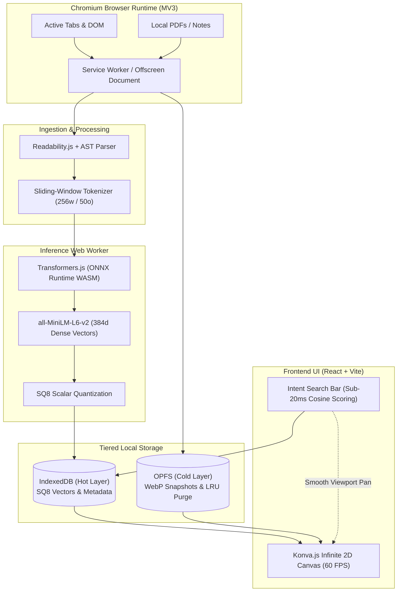

# 🧭 Meridian: Spatial Cartographer
### *A Local-First Spatial Knowledge Engine & Vector Workspace*

[](https://developer.chrome.com/docs/extensions/mv3/intro/)
[](https://vitejs.dev/)
[](https://huggingface.co/docs/transformers.js)
[-0D99FF?style=flat-square)](https://konvajs.org/)
[](LICENSE)
[](https://www.thapar.edu/)

---

## 📌 Overview

Ever found yourself drowning under 70+ open browser tabs, scattered code snippets, and research PDFs while desperately trying to remember where you found that one critical insight? Standard bookmarking is too static, and cloud-based AI tools send your private browsing history to external servers with high latency and subscription costs.

**Meridian** solves cognitive overload and context fragmentation by turning your browsing and research artifacts into an interactive **2D spatial vector map** right inside your browser. Operating **100% on-device** via WebAssembly (WASM) and local storage primitives, Meridian semantically clusters your information landscape with zero latency, zero cloud costs, and total data privacy.

---

## ✨ Key Features

- **🧠 100% On-Device AI Embedding:** Powered by `@huggingface/transformers` (`Xenova/all-MiniLM-L6-v2`) running on ONNX Runtime WASM in background Web Workers to generate 384-dimensional dense vectors without ever making external API calls.
- **🗺️ 60 FPS Infinite Spatial Canvas:** Interactive 2D graph rendered using **Konva.js / HTML5 Canvas** featuring force-directed semantic clustering, card previews, and smooth viewport navigation.
- **⚡ Sub-20ms Intent Search:** Real-time cosine similarity search navigating the canvas directly to relevant concept clusters in $\le 20\text{ ms}$.
- **🌐 Multi-Source Ingestion Pipeline:** 
  - Real-time tab extraction with DOM decluttering via `Readability.js`.
  - Local research papers parsed via `pdf.js`.
  - Markdown notes and structured AST code blocks extracted from `<pre><code>` tags.
  - Deep Focus Mode with 256-token sliding-window chunking (50-token overlap).
- **🗄️ Tiered Local Storage Architecture:**
  - **Hot Layer (IndexedDB):** Stores SQ8 scalar-quantized vectors ($>70\%$ memory footprint reduction) and searchable metadata.
  - **Cold Layer (OPFS):** Origin Private File System stores compressed WebP visual thumbnails with an automated background LRU purge.
- **🔒 Privacy-Preserving & Offline-First:** Zero telemetry, no remote servers, and fully operational offline.
- **📦 Standalone Space Export:** Export your entire spatial knowledge map as a self-contained `.html` / `.json` bundle to share or archive.

---

## 🏗️ System Architecture

Meridian decouples heavy ML vector processing, UI rendering, and storage I/O across isolated threads adhering strictly to Chromium Manifest V3:



---

## 📊 Performance Targets & Benchmarks

| Metric | Target Specification | Attribution / Evaluation |
| :--- | :--- | :--- |
| **Search Retrieval Latency (SRL)** | **$\le 20\text{ ms}$** | `performance.now()` across 200+ indexed artifacts |
| **Canvas Rendering Smoothness** | **$\ge 55\text{--}60\text{ FPS}$** | Viewport culling & Konva.js batch draw loops |
| **Storage Footprint Reduction** | **$\ge 70\%$ savings** | SQ8 Int8 quantization vs. raw Float32 embeddings |
| **Tab Ingestion Latency** | **$\le 1.5\text{ s}$** | Off-thread DOM sanitization & vector generation |
| **Offline Reliability** | **$100\%$ Local** | Zero external network calls or remote dependencies |

---

## 📂 Repository Structure

```text
meridian/
├── UCS503p-202627-MERIDIAN/
│   ├── assets/                      # Logos, icons, and UI stylesheets
│   │   ├── tiet-logo.svg
│   │   ├── favicon.png
│   │   └── stylesheets/extra.css
│   ├── code/                        # Core codebase and native modules
│   │   ├── Makefile                 # C++ compilation workflow
│   │   ├── inc/                     # C++ header files
│   │   └── src/                     # C++ libraries & runner entry points
│   ├── docs/                        # MkDocs documentation source
│   │   ├── diagrams/                # Architectural, DFD, and Use Case diagrams
│   │   │   ├── data flow diagrams/  # Level 0, Level 1, Level 2 DFDs (LaTeX / TikZ & PDF)
│   │   │   └── use case diagrams/   # Use case diagrams (Draw.io & PNG)
│   │   └── journals/                # Documentation site journals symlink
│   ├── journals/                    # Team weekly work logs and ticket resolutions
│   │   ├── 1024030xxx-bhanurekha/
│   │   └── 1024030xxx-vidya/
│   ├── project-proposal/            # LaTeX Project Proposal documentation
│   │   └── main.tex
│   ├── project-report-prototype-stage/ # Prototype Stage LaTeX Report
│   ├── project-report-final/        # Final Academic LaTeX Report
│   ├── Makefile                     # Root Makefile for docs & assets
│   ├── mkdocs.yml                   # MkDocs Material configuration
│   └── README.md
```

---

## 🚀 Getting Started

### 1. Prerequisites
- **Node.js**: `v18.0.0` or higher
- **Package Manager**: `npm` / `pnpm` / `yarn`
- **Python**: `3.10+` (for local MkDocs build)
- **C++ Compiler**: `g++` / `clang++` supporting C++17 (for native modules)

---

### 2. Building & Serving the Documentation

The documentation site is powered by [`mkdocs-material`](https://squidfunk.github.io/mkdocs-material/).

```bash
# Navigate to the project folder
cd UCS503p-202627-MERIDIAN

# Start local MkDocs live-reload server
make docs

# Or build static documentation
make docbuild
```

---

### 3. Compiling the C++ Modules

```bash
# Navigate to the code directory
cd UCS503p-202627-MERIDIAN/code

# Build dynamic libraries and executable
make all

# Clean build artifacts
make clean
```

---

## 👥 Authors & Team Information

This project is developed as part of **UCS503P: Software Engineering Project** at **Thapar Institute of Engineering and Technology (TIET)** under the supervision of **Dr. Jeelani Asif**.

| Name | Roll Number | Email | Department |
| :--- | :--- | :--- | :--- |
| **Rahul Dadwal** | `1024160014` | [`rdadwal_be24@thapar.edu`](mailto:rdadwal_be24@thapar.edu) | Computer Science & Engineering |
| **Jyotsna Sachdeva** | `1024160133` | [`jsachdeva_be24@thapar.edu`](mailto:jsachdeva_be24@thapar.edu) | Computer Science & Engineering |
| **Bisman Singh Rai** | `1024160130` | [`brai_be24@thapar.edu`](mailto:brai_be24@thapar.edu) | Computer Science & Engineering |

---

## 📜 License

This project is licensed under the [MIT License](LICENSE).
