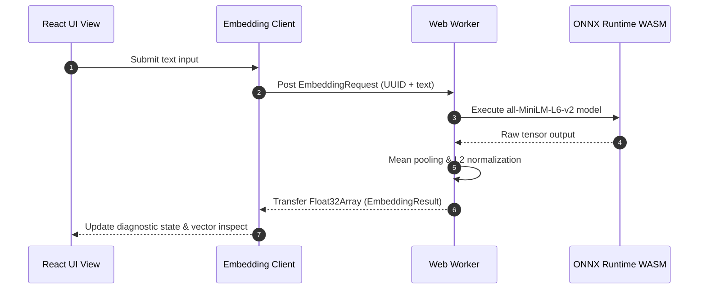

# Prototype Demonstration

## 🚀 Demonstration Scope

The current live demonstration covers the verified **Milestone 1 Foundation Prototype**.

It proves that Meridian successfully executes local machine learning within a modern browser extension:

- [x] Loads cleanly as a Chromium Manifest V3 extension.
- [x] Launches its primary workspace interface from the extension toolbar.
- [x] Accepts arbitrary natural-language text from the user.
- [x] Generates authentic semantic embeddings **100% on-device**.
- [x] Produces normalized dense vectors with **exactly 384 numerical dimensions**.
- [x] Executes neural network inference via WebAssembly (WASM) without external runtimes.
- [x] Continues embedding computation when physical network connections are completely disabled.

!!! warning "Features Not in Current Demo"
    Active-tab extraction, persistent IndexedDB storage, the full 2D Konva.js canvas, and multi-document search belong to subsequent development milestones and are intentionally not present in the Milestone 1 demonstration.

---

## 🛠️ Build & Installation Guide

The foundation prototype is built from source within the repository:

```bash
# 1. Navigate to the extension source directory
cd code/extension/

# 2. Install dependencies (Node.js 22.12+ required)
npm install

# 3. Download and verify pinned model assets & WASM binaries
npm run setup

# 4. Build the production Manifest V3 extension bundle
npm run build
```

The extension bundle is emitted to:

```text
code/extension/dist/
```

### Loading Unpacked in Chromium

1. Open a Chromium-based browser (Google Chrome, Chromium, Brave, or Edge).
2. Navigate to `chrome://extensions/`.
3. Enable **Developer mode** via the toggle in the top-right corner.
4. Click **Load unpacked** and select the `code/extension/dist/` directory.
5. Confirm that **Meridian Foundation** appears in your active extensions.

---

## 🎬 Step-by-Step Demonstration Script

### Step 1: Launch the Extension
Click the **Meridian icon** on the Chromium extension toolbar. The background service worker (`background.ts`) responds to `chrome.action.onClicked` and opens the Meridian application in a full tab.

### Step 2: Inspect the Embedding Diagnostic Interface
The application tab displays the **Embedding Diagnostic** view, confirming the runtime environment:
- **Model:** `Xenova/all-MiniLM-L6-v2`
- **Output Dimensions:** 384
- **Backend:** WebAssembly (`wasm`)
- **Remote Fetching:** Disabled

### Step 3: Generate Real Vector Embeddings
Enter a sample sentence in the input field:

```text
A cat is sleeping on a warm windowsill.
```

Click **Generate Embedding**. The UI initiates the worker pipeline and renders:

- **Dimensions:** `384`
- **Backend:** `wasm`
- **L2 Vector Norm:** `1.000000` (unit normalized)
- **Execution Time:** displayed in milliseconds
- **Vector Inspector:** expand the numerical array to inspect all 384 floating-point coordinates.



### Step 4: Demonstrate Offline Verification
1. Open the operating system network controls and **disconnect Wi-Fi** (or toggle Chrome DevTools Network to *Offline*).
2. Enter a new test sentence:
   ```text
   A kitten is resting beside the sunny window.
   ```
3. Click **Generate Embedding**.
4. The embedding generates successfully with zero latency degradation, proving that **no network calls, cloud AI services, API keys, or remote downloads** are involved.

### Step 5: Validate Semantic Similarity
Compare the mathematical cosine similarity between related and unrelated sentence pairs:

$$	ext{Cosine Similarity}(\mathbf{u}, \mathbf{v}) = rac{\mathbf{u} \cdot \mathbf{v}}{\|\mathbf{u}\|_2 \|\mathbf{v}\|_2}$$

| Sentence Pair Comparison | Conceptual Relationship | Observed Cosine Similarity | Interpretation |
|---|---|:---:|---|
| **Sentence A:** *"A cat is sleeping on a warm windowsill."*<br>**Sentence B:** *"A kitten is resting beside the sunny window."* | Highly Related | **$pprox +0.589$** | Strong positive semantic alignment; vectors cluster closely in latent space. |
| **Sentence A:** *"A cat is sleeping on a warm windowsill."*<br>**Sentence C:** *"Database transactions provide atomicity and isolation."* | Completely Unrelated | **$pprox -0.069$** | Orthogonal / negative semantic correlation; vectors separate in latent space. |

---

## 📊 Recorded Foundation Performance Benchmarks

The following benchmark metrics were collected during Milestone 1 verification testing:

| Performance Metric | Recorded Value | Measurement Context |
|---|:---:|---|
| **Output Vector Dimension** | **384** | Normalized float array |
| **Execution Backend** | **WASM** | CPU SIMD instructions |
| **Cold Start Latency** | **$pprox 360	ext{ ms}$** | Initial model load from local disk into worker memory |
| **Warm Start Latency** | **$pprox 7	ext{--}8	ext{ ms}$** | Subsequent sentence inference with resident model |
| **Related Cosine Similarity** | **$+0.589$** | Semantic alignment test |
| **Unrelated Cosine Similarity** | **$-0.069$** | Semantic separation test |
| **External Network Probes** | **Blocked** | Monitored via Chromium Network panel |
| **External API Keys Required** | **None** | $100\%$ zero-cost local execution |

---

## 🎯 What the Milestone 1 Prototype Establishes

The Foundation Prototype validates core engineering feasibility:

1. **Client Machine Learning is Practical:** Lightweight transformer models (`all-MiniLM-L6-v2`) achieve sub-10ms warm inference within standard browser threads.
2. **Thread Isolation Prevents UI Freezes:** Delegating tensor operations to dedicated Web Workers preserves 60 FPS responsiveness on the UI thread.
3. **Local Privacy is Achievable:** High-quality semantic search vectors can be generated without sending private user data across the network.
