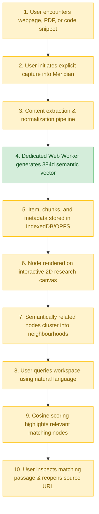

# Problem & Users

## 🚨 Problem Statement

Students, developers, and researchers regularly work across dozens of browser tabs, technical documentation pages, code references, research papers, and notes. As information density increases, users experience cognitive friction trying to recall:

- What specific information each open source contains.
- Why a particular tab or document was originally opened.
- How isolated concepts, code snippets, and evidence relate to one another.

Traditional browser architectures represent tabs and bookmarks as **flat, linear lists**. They provide minimal support for preserving or recovering the conceptual relationships between sources.

Meridian addresses five tightly connected problem areas inherent in modern web research.

---

## 🧩 Core Problem Dimensions

### 1. Research Fragmentation
Modern research materials are scattered across disparate, siloed media:

- Dozens of simultaneously open browser tabs.
- Static browser bookmark lists.
- Downloaded PDF papers and preprints.
- Local Markdown notes and README files.
- Online technical documentation and API specifications.
- Ad-hoc code snippets and terminal commands.
- Structured reference tables and benchmark data.

Users are forced to manually maintain mental indexes of where specific knowledge resides and which source contained a given breakthrough or formula.

### 2. Tab Overload and Context Loss
As browser tabs accumulate, titles become truncated, favicons shrink, and tabs become indistinguishable. When users return to a research session after hours or days, significant cognitive overhead is wasted re-reading pages to answer:

- Why this specific page was deemed relevant.
- Which research sub-topic or milestone it supported.
- Whether it provided concrete implementation code, theoretical justification, or general background.
- How it connected to other tabs in the working set.

### 3. Shallow Search and Brittle Organization
Conventional bookmarking tools rely on rigid folders and URL/title strings. Standard keyword search frequently fails when a user remembers the conceptual *meaning* of an idea, but not the exact phrase used by the author:

> **Example:** A developer searching for *"How browser applications store information without a server"* may completely miss an article discussing *"Client-side IndexedDB persistence, Service Worker caching, and OPFS primitives"* because the exact search terms do not overlap.

Meridian resolves this by performing high-dimensional vector search based on **semantic intent** rather than literal keyword matching.

### 4. Privacy Risks and Cloud Dependence
Contemporary AI-assisted research extensions frequently route private browsing data, reading history, and search queries to external third-party cloud servers. This introduces substantial friction:

- Exposing sensitive internal codebases, intellectual property, and browsing habits to third-party telemetry.
- Requiring continuous, active internet connectivity for basic search functionality.
- Imposing recurring subscription costs and personal API key management.
- Risking service outages and latency spikes during deep focus sessions.

### 5. Storage and Client Performance Pressure
Retaining complete webpage snapshots, screenshots, extracted passages, and floating-point vector arrays inside a client browser can rapidly exhaust memory and disk quotas. Meridian addresses this systemic pressure through:

- Scalar quantization of dense vectors (SQ8 Int8 representation).
- Structural segregation of searchable structured records and heavy binary assets.
- On-demand streaming of visual previews.
- Viewport culling algorithms for rendering large node graphs.
- Configurable, age-based storage lifecycle policies.
- Guaranteed retention rules protecting user-pinned items.

---

## 👥 Intended Users

| User Persona | Research Workflow & Pain Points | Meridian Solution & Value |
|---|---|---|
| **Students** | Conducting literature reviews, aggregating documentation across diverse course subjects, losing context between study sessions. | Preserves conceptual links between articles and lecture notes without requiring tedious manual folder organization. |
| **Researchers** | Ingesting extensive PDF preprints, technical articles, and notes; requiring passage-level recall across multi-page papers. | **Deep Focus Mode** indexes fine-grained text chunks, allowing queries to retrieve the exact supporting paragraph. |
| **Developers** | Navigating API docs, library changes, StackOverflow threads, code snippets, and configuration tables while debugging. | Preserves syntax-highlighted code blocks, parameter tables, and contextual headings for instant recall. |

---

## 📋 User Needs

Through user workflow analysis, Meridian identifies ten essential needs:

1. **Effortless Capture:** Quickly save research material without stopping to manually categorize it into folders.
2. **Context Recovery:** Instantly understand why a source was captured and how it relates to neighbouring topics.
3. **Semantic Discovery:** Search by concept, intuition, or paraphrase rather than exact wording.
4. **Absolute Privacy:** Guarantee that sensitive browsing, notes, and code never leave the local machine.
5. **Offline Reliability:** Continue searching, reading, and organizing without an active internet connection.
6. **Passage-Level Grounding:** Inspect the exact excerpt or paragraph responsible for a search match.
7. **Spatial Visualization:** Explore concepts spatially on a two-dimensional graph where proximity reflects meaning.
8. **Direct Traceability:** Reopen the live original URL or file source with a single click.
9. **Asset Protection:** Prevent critical, user-pinned research nodes from being purged by automated storage cleanups.
10. **Data Ownership:** Freely export and import the entire spatial workspace as portable, open JSON/HTML bundles.

---

## 🗺️ Intended End-to-End User Journey

!!! info "Milestone 1 Implementation Status"
    The **Milestone 1 Foundation Prototype** successfully implements **Step 4** (on-device 384-dimensional semantic embedding generation using WebAssembly). The upstream capture steps (Steps 1–3) and downstream storage, canvas, and search workflows (Steps 5–10) are scheduled across subsequent milestones.
