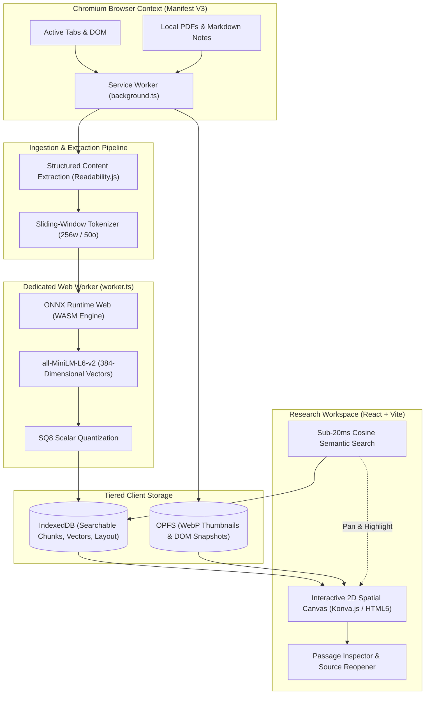
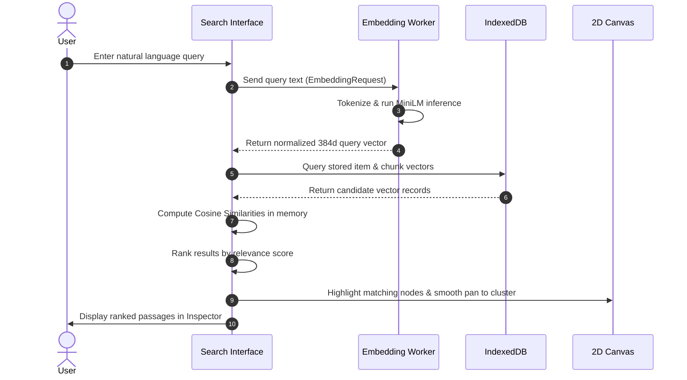

# Solution Architecture

## 💡 Solution Overview

**Meridian** is architected as a local-first Chromium Manifest V3 extension featuring a full-tab interactive research canvas and a compact capture interface. The system converts raw research artifacts into high-dimensional semantic vectors, projects item-level vectors onto an interactive two-dimensional canvas, and preserves fine-grained chunk vectors for detailed passage retrieval.

Operating completely on-device, Meridian eliminates server dependencies, cloud subscription costs, and third-party data transmission.



---

## 🧠 Local Semantic Embedding Pipeline

Meridian executes machine learning inference inside the browser using:

- **Library:** `@huggingface/transformers`
- **Model:** `Xenova/all-MiniLM-L6-v2` (pinned revision `751bff37182d3f1213fa05d7196b954e230abad9`)
- **Runtime:** ONNX Runtime Web via WebAssembly (WASM) CPU backend
- **Threading:** Dedicated background `Web Worker`

The MiniLM transformer model converts input text into a **normalized dense vector containing exactly 384 numerical values**. Conceptually related texts produce vectors with high cosine similarity ($pprox 0.589$), while unrelated texts yield near-zero or negative similarity ($pprox -0.069$).

```text
Input Text  --> Tokenizer --> ONNX Runtime (WASM) --> Mean Pooling --> L2 Normalization --> 384d Dense Vector
```

!!! tip "Performance Optimization Path"
    The foundation currently operates via the **WASM CPU backend**, ensuring universal compatibility across Chromium systems. WebGPU execution remains a planned future optimization following browser stability and reliability benchmarks.

---

## 🧩 Chromium Manifest V3 Architecture

Meridian adheres to the strict security, memory, and lifecycle constraints of Chromium Manifest V3:

- **Background Service Worker (`background.ts`):** Listens for user clicks on the extension toolbar action and opens the full-tab workspace via `chrome.tabs.create` using an internal `chrome.runtime.getURL` path.
- **Stateless Execution:** Long-running ML inference is intentionally isolated in dedicated Web Workers owned by the application tab rather than the background service worker, preventing failures when Chromium suspends inactive service workers.
- **Security Sandboxing:** A restrictive Content Security Policy (CSP) enforces `script-src 'self' 'wasm-unsafe-eval'`, strictly forbidding remote executable scripts or external network calls.

---

## 🖥️ Research Workspace Design

The planned user interface direction includes:

1. **Full-Tab 2D Canvas:** An infinite spatial plane where research items appear as cards positioned according to semantic meaning.
2. **Compact Capture Side Panel:** A non-intrusive drawer to initiate active-tab ingestion without disrupting browsing.
3. **Semantic Search & Filter Bar:** Top-level natural language query bar with instant keyword and cosine scoring.
4. **Passage Inspector:** Contextual drawer displaying the exact paragraph or code snippet matching a search query.
5. **Canvas Navigation Controls:** Zoom to fit, reset viewport, cluster filtering, and node arrangement locks.
6. **Status Monitors:** Visual indicators for model loading, indexing queue, and system memory health.

---

## 📥 Ingestion & Capture Modes

### Lightweight Mode
Designed for rapid bookmarking with minimal storage consumption:
- Captures title, URL, timestamp, representative excerpt, and a single item-level 384d vector.
- Prioritizes capture speed ($<500	ext{ ms}$) and compact storage.

### Deep Focus Mode
Designed for thorough, passage-level research:
- Captures full extracted prose, structured code blocks, and data tables.
- Employs a **256-token sliding window with a 50-token overlap** aligned with the MiniLM tokenizer.
- Generates individual embeddings for every chunk alongside an aggregate centroid vector for canvas positioning.

| Ingestion Source | Technical Handling | Scope Boundary |
|---|---|---|
| **Webpages** | Mozilla `Readability.js` with semantic block preservation and raw DOM fallbacks. | Scraped ads, navbars, and tracking scripts are stripped. |
| **PDF Documents** | Local parsing via `PDF.js` extracting text layers with page index references. | Scanned PDFs without OCR text layers are flagged. OCR is out of scope. |
| **Markdown Notes** | Local file reader preserving hierarchical `#` headings, tables, and fenced code blocks. | Raw Markdown AST parsed on-device. |
| **Code Snippets** | Explicit user paste with automatic language detection or manual tag. | Full language compiler AST analysis is deferred. |

---

## 🔍 Semantic Search & Retrieval Workflow



---

## 🗺️ Spatial Organization (2D Canvas)

Meridian translates high-dimensional vectors (384 dimensions) into navigable 2D coordinates $(x, y)$ using **UMAP (Uniform Manifold Approximation and Projection)** executing inside an isolated layout worker.

Key spatial layout features:
- **Collision Avoidance:** A force-directed relaxation step eliminates overlapping cards while preserving topological neighbourhoods.
- **Coordinate Persistence:** Layout coordinates are saved in IndexedDB across browser sessions.
- **Pinning & User Customization:** Manually repositioned or pinned cards remain fixed; automatic reorganization respects user arrangements.
- **Viewport Culling:** Only nodes visible within the current zoom and pan boundaries are actively rendered, targeting smooth **60 FPS** performance.

---

## 🗄️ Tiered Local Storage Architecture

```text
+-----------------------------------------------------------------------+
|                       Browser Storage Tier                            |
+-----------------------------------+-----------------------------------+
|     Hot Tier: IndexedDB           |      Cold Tier: OPFS              |
|                                   |                                   |
|  - Item & Chunk Metadata          |  - Compressed WebP Thumbnails     |
|  - 384d SQ8 Quantized Vectors     |  - Full DOM Document Snapshots    |
|  - UMAP 2D Canvas Coordinates     |  - Large Binary Cached Assets     |
|  - Persistent Processing Queue    |  - Automatic 7-Day Inactive Purge |
|  - User Workspace Settings        |  - Pinned Item Protection         |
+-----------------------------------+-----------------------------------+
```

- **Storage Lifecycle:** Unpinned preview thumbnails become eligible for automatic cleanup after 7 inactive days, while searchable text and vectors are preserved.
- **Data Portability:** Complete workspaces can be exported as structured, versioned `.json` bundles or standalone `.html` offline viewers with inert, sanitized scripts.
