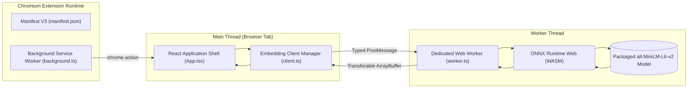
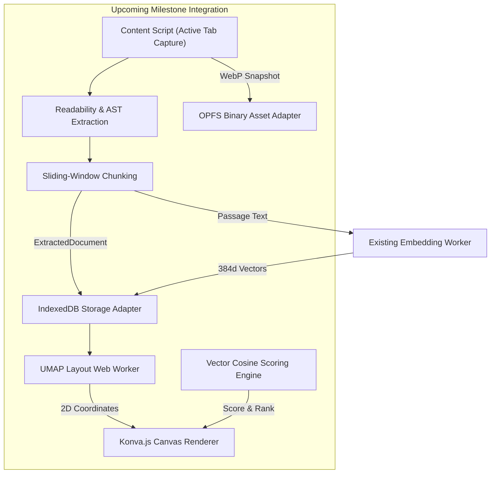

# System Integration

## 🔌 Integrated Architecture Overview

The completed Meridian Foundation Prototype integrates five core software layers operating across separate threads within the Chromium browser environment:



---

## ⚙️ Core Implemented Components

### 1. Manifest V3 Configuration (`manifest.json`)
The extension manifests under Chromium Manifest V3:
- **Background Worker:** Configured as an ES Module (`"service_worker": "src/background/background.ts", "type": "module"`).
- **Action:** Declares toolbar entry point (`chrome.action`).
- **Content Security Policy (CSP):** Enforces strict isolation:
  ```text
  script-src 'self' 'wasm-unsafe-eval'; object-src 'self';
  ```
- **Permissions:** Zero broad host permissions requested at foundation stage; only minimal permissions required for tab orchestration.

### 2. Background Service Worker (`background.ts`)
The background service worker acts purely as a coordinator:
- Listens for `chrome.action.onClicked`.
- Spawns the extension application tab using `chrome.tabs.create({ url: chrome.runtime.getURL("index.html") })`.
- **Architectural Safeguard:** Inference state is intentionally kept *out* of the service worker to prevent failures when Chromium terminates idle background workers.

### 3. React Application View (`src/ui/`)
Built with React 18, Vite, and TypeScript:
- Implements the **Milestone 1 Diagnostic UI**.
- Collects input text, dispatches requests to the client, and monitors asynchronous lifecycle events.
- Displays vector metrics: dimension count, execution time, backend target, and vector L2 norm.

### 4. Embedding Client Manager (`src/embedding/client.ts`)
Main-thread singleton managing worker communication:
- Spawns and manages the lifecycle of the dedicated Web Worker.
- Assigns unique request UUIDs to track pending asynchronous inference jobs.
- Implements error boundaries and gracefully disposes of worker instances upon page teardown.

### 5. Dedicated Embedding Web Worker (`src/embedding/worker.ts`)
Executes all computational machine learning tasks off-thread:
- Configures `@huggingface/transformers` to operate exclusively with packaged local assets:
  ```typescript
  env.allowLocalModels = true;
  env.allowRemoteModels = false;
  env.useBrowserCache = false;
  ```
- Loads the quantized ONNX model and WASM execution glue from the extension package.
- Executes tokenization, inference, mean pooling, and vector normalization.
- Returns vectors via high-performance **Transferable Objects** (`ArrayBuffer`) to eliminate serialization overhead.

---

## 🔒 Local Asset Packaging & Verification

To guarantee reproducibility and offline execution without remote HuggingFace CDN fetches, model assets are locked and verified locally:

```text
code/extension/
├── assets.lock.json           # SHA-256 Checksums for pinned model files
└── dist/
    ├── model/                 # Packaged ONNX model & tokenizer files
    │   ├── config.json
    │   ├── model_quantized.onnx
    │   ├── tokenizer.json
    │   ├── tokenizer_config.json
    │   └── vocab.txt
    └── wasm/                  # ONNX Runtime WASM binary & glue
        ├── ort-wasm-simd.wasm
        └── ort-wasm-threaded.wasm
```

The asset verification pipeline (`assets.lock.json`) ensures that:
- The model revision matches `Xenova/all-MiniLM-L6-v2@751bff3`.
- SHA-256 hashes of the tokenizer, vocab, and quantized weights match recorded signatures.
- Missing or corrupted files fail the build immediately before deployment.

---

## 📜 Shared TypeScript Data Contracts

To enable parallel development across the team without merge conflicts or interface drift, all subsystems communicate using shared TypeScript contracts defined in `code/extension/src/shared/contracts.ts`:

| Interface Contract | Role & Responsibility | Fields / Properties |
|---|---|---|
| `ExtractedDocument` | Canonical representation of captured content | `id`, `url`, `title`, `sourceType`, `normalizedText`, `blocks`, `headings`, `codeBlocks`, `tables`, `capturedAt` |
| `CanvasItem` | State representation of a node on the 2D canvas | `id`, `title`, `sourceType`, `excerpt`, `canvasX`, `canvasY`, `isPinned`, `clusterId`, `processingStatus` |
| `EmbeddingRequest` | Message dispatched to inference Web Worker | `requestId` (UUID), `text`, `modelTarget` |
| `EmbeddingResponse` | Message received from inference Web Worker | `requestId`, `status` (`pending` \| `complete` \| `error`), `payload` |
| `EmbeddingResult` | Final vectorized output payload | `dimensions` (384), `vector` (`Float32Array`), `backend` (`wasm`), `latencyMs` |

---

## 🔄 Planned Subsystem Integration



### Persistent Job States
Ingestion tasks will transition through deterministic states to ensure recovery across tab reloads:
```text
[queued]  -->  [extracting]  -->  [chunking]  -->  [embedding]  -->  [ready]
                                                                \->  [failed]
```

### Zero Cloud Backend Integration
Meridian requires **no cloud backend servers, remote databases, or paid AI APIs**. All capture, indexing, vector storage, and search operations execute natively within Chromium.
